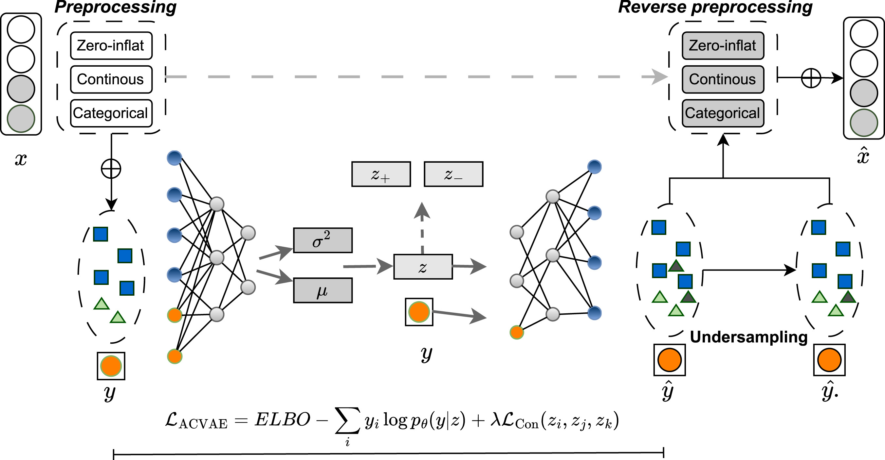

# Addressing imbalance in health data: Synthetic minority oversampling using deep learning
#### Alex X. Wang, Viet-Tuan Le, Hau N. Trung  and Binh P. Nguyen(https://people.wgtn.ac.nz/b.nguyen) ∗

## Abstract
Class imbalances in healthcare data, characterized by a disproportionate number of positive cases compared to negative ones, can lead to biased machine learning models that favor the majority class. Ensuring good performance across all classes is crucial for improving healthcare delivery and patient safety. Traditional oversampling methods like SMOTE and its variants face several limitations: they struggle with capturing complex data distributions, handling heterogeneous data types, and natively supporting multi-class datasets. To address these issues, we propose a deep learning based solution using an Auxiliary-guided Conditional Variational Autoencoder (ACVAE) enhanced with contrastive learning. Additionally, we introduce an ensemble technique where ACVAE creates synthetic positive samples, followed by the use of the Edited Centroid-Displacement Nearest Neighbor (ECDNN) algorithm to reduce the majority class. This combined approach takes advantage of ACVAE’s ability to produce diverse oversampled data and ECDNN’s skill in handling noise through selective undersampling, leading to a more balanced and informative dataset. Our experiments on 12 different health datasets show the effectiveness of our method. We conduct a thorough evaluation of our approach against traditional oversampling techniques and several benchmark machine learning models. The results demonstrate notable improvements in model performance across various metrics, highlighting the potential of deep learning based synthetic oversampling to address class imbalances in healthcare data.



## Availability and implementation
Source code and data are available at [GitHub](https://github.com/coksvictoria/ACVAE)

### High-Level steps
+ Step 1. Load Data:
  
+ Step 2. Run Baseline Models:

+ Step 3. Train and Run ACVAE w/o ECDNN:

## Contact 
[Go to contact information](https://homepages.ecs.vuw.ac.nz/~nguyenb5/contact.html)

## Reference
We appreciate your citations if you find this repository useful to your research!
```
@article{wang2025addressing,
  title={Addressing imbalance in health data: Synthetic minority oversampling using deep learning},
  author={Wang, Alex X and Le, Viet-Tuan and Trung, Hau Nguyen and Nguyen, Binh P},
  journal={Computers in Biology and Medicine},
  volume={188},
  pages={109830},
  year={2025},
  publisher={Elsevier}
}
```
